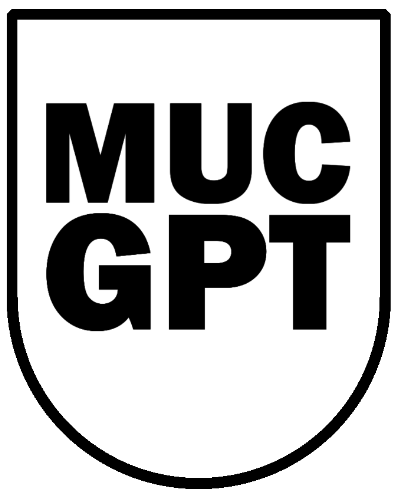
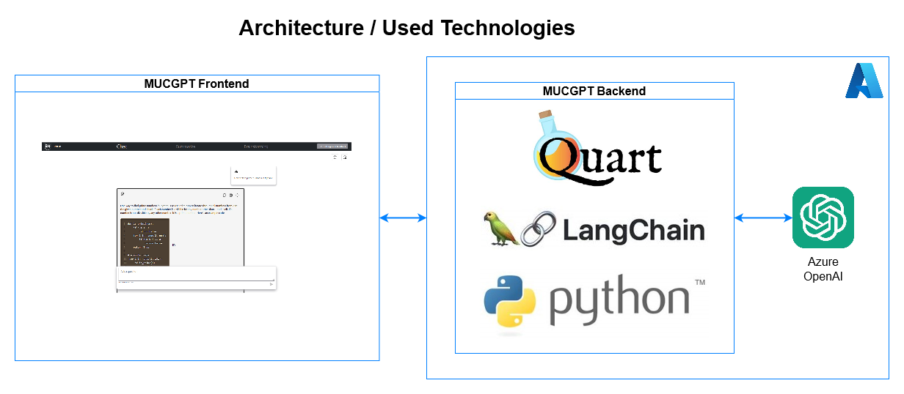

# MUCGPT

<!-- PROJECT LOGO -->
<div align="center">
  <a href="#">
    
  </a>
</div>
<br />

<!-- ABOUT THE PROJECT -->
[![Made with love by it@M][made-with-love-shield]][itm-opensource]
[![GitHub license][license-shield]][license]
[![GitHub release version][github-release-shield]][releases]

[made-with-love-shield]: https://img.shields.io/badge/made%20with%20%E2%9D%A4%20by-it%40M-yellow?style=for-the-badge
[license-shield]: https://img.shields.io/github/license/it-at-m/itm-prettier-codeformat?style=for-the-badge
[github-release-shield]: https://img.shields.io/github/v/release/it-at-m/mucgpt?style=for-the-badge

[itm-opensource]: https://opensource.muenchen.de/
[license]: https://github.com/it-at-m/mucgpt/blob/main/LICENSE
[releases]: https://github.com/it-at-m/mucgpt/releases
MUCGPT provides a web interface based on a large language model (LLM). The interface currently uses ChatGPT3.5, which allows users to chat, summarise text and brainstorm. The chat function allows text to be generated and refined in several steps. Summarizing allows PDFs or text to be shortened and made more concise. Brainstorming allows users to create mind maps for different topics. The included IAC files for Azure make it easy to deploy the project in just a few steps.

Why should you use MUCGPT? See for yourself:  
  
 


## Built With

The documentation project is built with technologies we use in our projects (see [requirements-dev.txt](/requirements-dev.txt)):
### Backend:
* [Python 3.9, 3.10 or 3.11](https://www.python.org/downloads/)
* [Quart](https://pgjones.gitlab.io/quart/)
* [LangChain](https://www.langchain.com/)

### Frontend:

* [React](https://de.react.dev/)
* [Typescript](https://www.typescriptlang.org/)
* [Javascript](https://wiki.selfhtml.org/wiki/JavaScript)

### Deployment:
  * [Node.js 14+](https://nodejs.org/en/download/package-manager)
  * [Git](https://git-scm.com/downloads)
  * Python 12
  * Docker

## Table of contents
* [Built With](#built-with)
* [Roadmap](#roadmap)
* [Run](#Run)
* [Documentation](#documentation)
* [Contributing](#contributing)
* [License](#license)
* [Contact](#contact)

## Roadmap


See the [open issues](https://github.com/it-at-m/mucgpt/issues) for a full list of proposed features (and known issues).

## Run
 Configure your environment in [config/default.json](config/default.json). The schema of the configuration is [cofnig/mucgpt_config.schema.json](config/mucgpt_config.schema.json) described.  Insert Model Endpoint and API Key for your connection to an OpenAI completion endpoint or an Azure OpenAI completions endpoint.
### Run locally
```
cd app\backend
pip install --no-cache-dir --upgrade -r requirements.txt   
cd ..\frontend
npm run build
cd ..\backend
$env:MUCGPT_CONFIG="path to default.json"
$env:MUCGPT_BASE_CONFIG="path to base.json"
python -m  quart --app main:app run
```


### Run with docker
1. Build an Image
   ``` docker build --tag mucgpt-local . --build-arg   fromconfig="./config/default.json"```
2. Run the image ```docker run --detach --publish 8080:8000  mucgpt-local```


## Documentation
  
 The architecture of MUCGPT is divided into two parts, the frontend and the backend. MUCGPT is deployed on Microsoft Azure as an AppService with a PostgreSQL database and an Azure OpenAI resource.
  
The frontend is based on a template from [Microsoft Azure](https://github.com/Azure-Samples/azure-search-openai-demo) and is implemented using React, Typescript and Javascript.
  
The framework used to implement the backend of MUCGPT is called [Quart](https://pgjones.gitlab.io/quart/). It is a fast Python web microframework for building JSON APIs, rendering and serving HTML, serving web sockets and much more. The backend uses LangChain to connect to LLMs. In the [config](config/default.json) file, you can provide the user with various LLM options to select from in the frontend.

  
For more information about all the features of MUCGPT click [here](/docs/FEATURES.md).  
  
A cheatsheat to use MUCGPT is located [here](app/frontend/src/assets/mucgpt_cheatsheet.pdf).

## Contributing

Contributions are what make the open source community such an amazing place to learn, inspire, and create. Any contributions you make are **greatly appreciated**.

If you have a suggestion that would make this better, please open an issue with the tag "enhancement", fork the repo and create a pull request. You can also simply open an issue with the tag "enhancement".
Don't forget to give the project a star! Thanks again!

1. Open an issue with the tag "enhancement"
2. Fork the Project
3. Create your Feature Branch (`git checkout -b feature/AmazingFeature`)
4. Commit your Changes (`git commit -m 'Add some AmazingFeature'`)
5. Push to the Branch (`git push origin feature/AmazingFeature`)
6. Open a Pull Request

More about this in the [CODE_OF_CONDUCT](/CODE_OF_CONDUCT.md) file.


## License

Distributed under the MIT License. See [LICENSE](LICENSE) file for more information.


## Contact

it@M - opensource@muenchen.de

