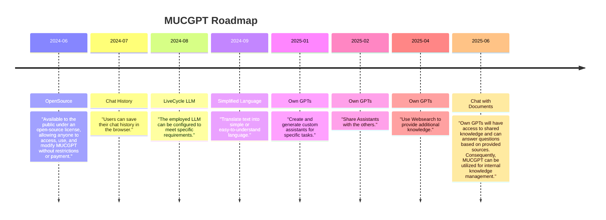

<!-- PROJECT LOGO -->
<div align="center">
  <a href="#">
    
  </a>
</div>
<br />

<!-- ABOUT THE PROJECT -->
[![Made with love by it@M][made-with-love-shield]][itm-opensource]
[![Gitmoij][gitmoij-shield]][gitmoij]
[![GitHub license][license-shield]][license]
[![GitHub release version][github-release-shield]][releases]
![Supported python versions][python-versions-shield]
![Supported npm versions][npm-versions-shield]
[![uv][uv-shield]][uv]
[![FastAPI][fastapi-shield]][fastapi]
[![React][react-shield]][fastapi]
[![Postgres][postgres-shield]][postgres]
[![Langchain][langchain-shield]][langchain]

[made-with-love-shield]: https://img.shields.io/badge/made%20with%20%E2%9D%A4%20by-it%40M-yellow?style=for-the-badge
[license-shield]: https://img.shields.io/github/license/it-at-m/itm-prettier-codeformat?style=for-the-badge
[github-release-shield]: https://img.shields.io/github/v/release/it-at-m/mucgpt?style=for-the-badge&color=orange
[python-versions-shield]: https://img.shields.io/badge/python-3.10|%203.11%20|%203.12-blue?style=for-the-badge
[gitmoij-shield]: https://img.shields.io/badge/gitmoij-😜😍-yellow?style=for-the-badge
[npm-versions-shield]: https://img.shields.io/badge/node-20+-blue?style=for-the-badge
[uv-shield]: https://img.shields.io/badge/⚡-uv-lightblue?style=for-the-badge
[fastapi-shield]: https://img.shields.io/badge/fastapi-lightblue?style=for-the-badge&logo=fastapi&logoColor=white
[react-shield]:https://shields.io/badge/react-lightblue?logo=react&style=for-the-badge&logoColor=white
[postgres-shield]: https://img.shields.io/badge/postgres-lightblue?&style=for-the-badge&logo=postgresql&logoColor=white
[langchain-shield]: https://img.shields.io/badge/LangChain-lightblue?&style=for-the-badge&logo=langchain&logoColor=white

[itm-opensource]: https://opensource.muenchen.de/
[license]: https://github.com/it-at-m/mucgpt/blob/main/LICENSE
[releases]: https://github.com/it-at-m/mucgpt/releases
[gitmoij]: https://gitmoji.dev/
[uv]: https://github.com/astral-sh/uv
[fastapi]: https://fastapi.tiangolo.com/
[react]: https://react.dev/
[postgres]: https://www.postgresql.org/
[langchain]: https://python.langchain.com/docs/introduction/

MUCGPT provides a web interface based for a given large language model (LLM). The whole package is shipped with a docker container

 The interface currently connects to one or multiple OpenAI-compatible LLM-enpdoints,  which allows users to chat, summarise text, brainstorm some ideas and translate a text to plain or easy language. The chat function allows text to be generated and refined in several steps. Summarizing allows PDFs or text to be shortened and made more concise. Brainstorming allows users to create mind maps for different topics. Simplified language allows the user to translate a text into plain or easy language, resulting in a more understandable and easier-to-read text.

In addition custom GPTs can be generated and saved. A own GPT is an assistant for a specific task with an custom system prompt.

See the [open issues](https://github.com/it-at-m/mucgpt/issues) for a full list of proposed features (and known issues).
## Table of contents
* [Built With](#built-with)
* [Getting Started](#getting-started)
* [Roadmap](#roadmap)
* [Documentation](#documentation)
* [Contributing](#contributing)
* [License](#license)
* [Contact](#contact)


## Built With

### Backend:
* [Python 3.10, 3.11 or 3.12](https://www.python.org/downloads/)
* [FastAPI](https://fastapi.tiangolo.com/)
* [LangChain](https://www.langchain.com/)

### Frontend:

* [React](https://de.react.dev/)
* [Typescript](https://www.typescriptlang.org/)
* [Javascript](https://wiki.selfhtml.org/wiki/JavaScript)

### Deployment:
  * [Node.js 20+](https://nodejs.org/en/download/package-manager)
  * [Git](https://git-scm.com/downloads)
  * Python 3.12
  * [uv](https://github.com/astral-sh/uv)
  * Docker


## Getting started

- Install uv: https://docs.astral.sh/uv/getting-started/installation/
  - [Using UV during development](/docs/DEVELOPMENT.md)
- Install [Node.js 20+](https://nodejs.org/en/download/package-manager)

### Install deps
Sync python environment vor development:
```bash
uv sync --all-extras # installs dev/test dependencies
# if you only want to run mucgpt without using development deps
uv sync
```
Install frontend deps
```bash
cd app/frontend
npm install
```
### Configure
 Configure your environment. For that copy the content of the empty config from [/config/.env.empty](/config/.env.empty) to the parent directory [.env](.env). Add at least one model by providing one OpenAi comptabile endpoint.

### Run locally
```bash
cd app\frontend
npm run buildlocal
cd ..\backend
uv run app.py
```


### Run with docker
1. Build an Image
   ``` docker build --build-arg COMMIT=$(git log -1 --format=%h) --build-arg VERSION=$(git describe --tags --abbrev=0) --tag mucgpt .```
2. Run the image ```docker run --detach --publish 8080:8000  --env-file=.env  mucgpt```

## Roadmap




## Documentation

 The architecture of MUCGPT is divided into two parts, the frontend and the backend. MUCGPT is deployed on Microsoft Azure as an AppService with a PostgreSQL database and an Azure OpenAI resource.

The frontend is based on a template from [Microsoft Azure](https://github.com/Azure-Samples/azure-search-openai-demo) and is implemented using React, Typescript and Javascript.

The framework used to implement the backend of MUCGPT is called [FastAPI](https://fastapi.tiangolo.com/). It is a modern, fast (high-performance), web framework for building APIs with Python based on standard Python type hints. The backend uses LangChain to connect to LLMs. In the [config](config/default.json) file, you can provide the user with various LLM options to select from in the frontend.


For more information about all the features of MUCGPT click [here](/docs/FEATURES.md).

A cheatsheat to use MUCGPT is located [here](app/frontend/src/assets/mucgpt_cheatsheet.pdf).

## Contributing

Contributions are what make the open source community such an amazing place to learn, inspire, and create. Any contributions you make are **greatly appreciated**.

If you have a suggestion that would make this better, please open an issue with the tag "enhancement", fork the repo and create a pull request. You can also simply open an issue with the tag "enhancement".
Don't forget to give the project a star! Thanks again!

1. Open an issue with the tag "enhancement"
2. Fork the Project
3. Create your Feature Branch (`git checkout -b feature/AmazingFeature`)
4. Commit your Changes (`git commit -m 'Add some AmazingFeature'`)
5. Push to the Branch (`git push origin feature/AmazingFeature`)
6. Open a Pull Request

More about this in the [CODE_OF_CONDUCT](/CODE_OF_CONDUCT.md) file.


## License

Distributed under the MIT License. See [LICENSE](LICENSE) file for more information.


## Contact

it@M - itm.kicc@muenchen.de
