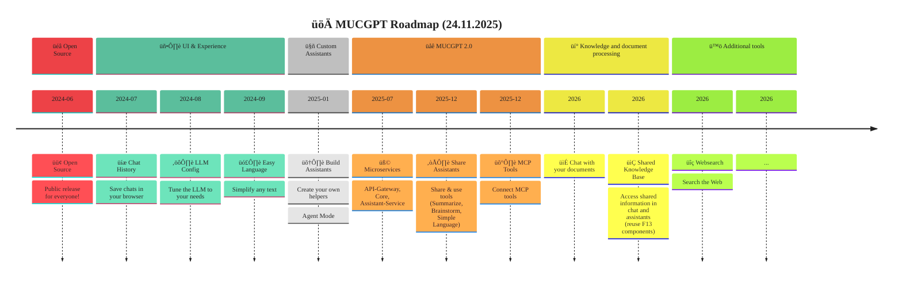

<!-- PROJECT LOGO -->
<div align="center">
  <a href="#">
    
  </a>
</div>
<br />

<div align="center">

<!-- Project / Meta -->
### Project Information

[![Made with love by it@M][made-with-love-shield]][itm-opensource]
[![Gitmoij][gitmoij-shield]][gitmoij]
[![GitHub license][license-shield]][license]
[![GitHub release version][github-release-shield]][releases]
[![Demo-Frontend][pages-shield]][pages]

<!-- Tech Stack -->
### Technology Stack

![Supported python versions][python-versions-shield]
![Supported npm versions][npm-versions-shield]
[![uv][uv-shield]][uv]
[![FastAPI][fastapi-shield]][fastapi]
[![React][react-shield]][react]
[![Postgres][postgres-shield]][postgres]
[![LangGraph][langgraph-shield]][langgraph]

<!-- CI -->
### Build Status

[![Assistant-service tests][assistant-service-tests-shield]][assistant-service-tests]
[![Core service tests][core-service-tests-shield]][core-service-tests]

<!-- Container Images -->
### Container Images

[![Frontend version][frontend-version-shield]][frontend-container]
[![Core service version][core-service-version-shield]][core-service-container]
[![Assistant service version][assistant-service-version-shield]][assistant-service-container]
[![Migrations service version][migrations-service-version-shield]][migrations-service-container]

</div>

<!-- ABOUT THE PROJECT -->

[made-with-love-shield]: https://img.shields.io/badge/made%20with%20%E2%9D%A4%20by-it%40M-blue?style=for-the-badge
[license-shield]: https://img.shields.io/github/license/it-at-m/itm-prettier-codeformat?style=for-the-badge&color=blue
[github-release-shield]: https://img.shields.io/github/v/release/it-at-m/mucgpt?style=for-the-badge&color=blue
[python-versions-shield]: https://img.shields.io/badge/python-3.10|%203.11%20|%203.12-blue?style=for-the-badge
[gitmoij-shield]: https://img.shields.io/badge/gitmoij-😜😍-blue?style=for-the-badge
[npm-versions-shield]: https://img.shields.io/badge/node-20+-blue?style=for-the-badge
[uv-shield]: https://img.shields.io/badge/⚡-uv-blue?style=for-the-badge
[fastapi-shield]: https://img.shields.io/badge/fastapi-blue?style=for-the-badge&logo=fastapi&logoColor=white
[react-shield]: https://shields.io/badge/react-blue?logo=react&style=for-the-badge&logoColor=white
[postgres-shield]: https://img.shields.io/badge/postgres-blue?&style=for-the-badge&logo=postgresql&logoColor=white
[langgraph-shield]: https://img.shields.io/badge/LangGraph-blue?&style=for-the-badge&logo=langgraph&logoColor=white
[pages-shield]: https://img.shields.io/badge/Demo-blue?logo=github&logoColor=white&style=for-the-badge
[frontend-version-shield]: https://img.shields.io/github/v/tag/it-at-m/mucgpt?filter=mucgpt-frontend-*&label=frontend&style=for-the-badge&color=blue
[core-service-version-shield]: https://img.shields.io/github/v/tag/it-at-m/mucgpt?filter=mucgpt-core-*&label=core-service&style=for-the-badge&color=blue
[assistant-service-version-shield]: https://img.shields.io/github/v/tag/it-at-m/mucgpt?filter=mucgpt-assistant-0*&label=assistant-service&style=for-the-badge&color=blue
[migrations-service-version-shield]: https://img.shields.io/github/v/tag/it-at-m/mucgpt?filter=mucgpt-assistant-migrations-*&label=migrations&style=for-the-badge&color=blue
[assistant-service-tests-shield]: https://github.com/it-at-m/mucgpt/actions/workflows/test-assistant-service.yaml/badge.svg
[core-service-tests-shield]: https://github.com/it-at-m/mucgpt/actions/workflows/test-core-service.yaml/badge.svg
[assistant-service-tests]: https://github.com/it-at-m/mucgpt/actions/workflows/test-assistant-service.yaml
[core-service-tests]: https://github.com/it-at-m/mucgpt/actions/workflows/test-core-service.yaml
[frontend-container]: https://github.com/it-at-m/mucgpt/pkgs/container/mucgpt%2Fmucgpt-frontend
[core-service-container]: https://github.com/it-at-m/mucgpt/pkgs/container/mucgpt%2Fmucgpt-core
[assistant-service-container]: https://github.com/it-at-m/mucgpt/pkgs/container/mucgpt%2Fmucgpt-assistant
[migrations-service-container]: https://github.com/it-at-m/mucgpt/pkgs/container/mucgpt%2Fmucgpt-assistant-migrations

MUCGPT is a system that enables users to interact with a large language model (LLM) through a web interface. This interaction is facilitated by an agentic system that can access several tools. To get a feel for it, take a look at our [demo frontend](https://it-at-m.github.io/mucgpt/).

Roles and rights management is facilitated by access to an OpenID Connect provider.

Users can create their own assistants and share them within the organisation. A personal assistant is a configuration of the MUCGPT agent, particularly the activated tools and system prompts.

See the [open issues](https://github.com/it-at-m/mucgpt/issues) for a full list of proposed features (and known issues).

## Table of contents

- [Built With](#️built-with)
- [Getting Started](#getting-started)
- [Roadmap](#%EF%B8%8F-roadmap)
- [Documentation](#documentation)
- [Contributing](#contributing)
- [License](#license)
- [Contact](#contact)

[itm-opensource]: https://opensource.muenchen.de/
[license]: https://github.com/it-at-m/mucgpt/blob/main/LICENSE
[releases]: https://github.com/it-at-m/mucgpt/releases
[gitmoij]: https://gitmoji.dev/
[uv]: https://github.com/astral-sh/uv
[fastapi]: https://fastapi.tiangolo.com/
[postgres]: https://www.postgresql.org/
[langgraph]: https://langchain-ai.github.io/langgraph/
[pages]: https://it-at-m.github.io/mucgpt/
[react]: https://react.dev/

## ⚒️ Built With

### Backend

- [Python 3.10, 3.11 or 3.12](https://www.python.org/downloads/)
- [FastAPI](https://fastapi.tiangolo.com/)
- [LangGraph](https://www.langchain.com/langgraph)

### Frontend

- [React](https://de.react.dev/)
- [Typescript](https://www.typescriptlang.org/)
- [Javascript](https://wiki.selfhtml.org/wiki/JavaScript)

### Deployment

- [Node.js 20+](https://nodejs.org/en/download/package-manager)
- [Git](https://git-scm.com/downloads)
- Python 3.12
- [uv](https://github.com/astral-sh/uv)
- Docker

## 🏃‍♂️‍➡️ Getting started

- Install uv: <https://docs.astral.sh/uv/getting-started/installation/>
  - [Using UV during development](/docs/DEVELOPMENT.md)
- Install [Node.js 20+](https://nodejs.org/en/download/package-manager)

### ⚙️ Configure the environment

Configuration can be found in form of an .env file

```bash
cd stack
cp .env.example .env
```

Below is an example of how to configure the `MUCGPT_CORE_MODELS` environment variable in your `.env` file. This variable defines the available LLM models for the core backend as a JSON array. Each object in the array specifies the model type, name, endpoint, API key, token limits, and a description.

```env
MUCGPT_CORE_MODELS='[
  {
    "type": "OPENAI",
    "llm_name": "<your-llm-name>",
    "endpoint": "<your-endpoint>",
    "api_key": "<your-sk>",
    "max_output_tokens": "<number>",
    "max_input_tokens": "<number>",
    "description": "<description>"
  }
]'
```

**Field descriptions:**

- `type`: The provider type (e.g., `OPENAI`).
- `llm_name`: The name or identifier of your LLM model.
- `endpoint`: The API endpoint URL for the model.
- `api_key`: The API key or secret for authentication.
- `max_output_tokens`: Maximum number of tokens the model can generate in a response.
- `max_input_tokens`: Maximum number of tokens accepted as input.
- `description`: A human-readable description of the model.

Replace the placeholder values with your actual model configuration.


### 🐋 Run with Docker

To start all required services using podman or docker run:

Requires `keycloak` to be present in the `hosts` file (see [RefArch-Docs](https://refarch.oss.muenchen.de/templates/develop.html#container-engine)).

```bash
# in case of podman run
podman compose  --build up
# in case of docker run
docker-compose  --build up
```

This command launches the following components:

- **Frontend**: A modern web interface built with React, providing users with an intuitive and responsive experience directly in their browser.
- **Core-Service**: Manages the agent to call LLMs. Also orchestrates tool usage.
- **Assistant-Service**: Manages assistants. An assistant is a configuration for an MUCGPT agent.
- **Assistant-Service-Migration**: Does database migrations on startup.
- **API Gateway**: Serves as the unified entry point for all client requests, efficiently routing traffic to backend services while managing authentication and security.
- **Keycloak**: A robust, open-source identity and access management system responsible for authentication, authorization, and user administration.
- **PostgresDB**: A reliable PostgreSQL database used to securely store and manage app statistics.

Once all services are running, you can access:

- The frontend at `localhost:8083` (Username: `mucgpt-user`, Password: `mucgpt`)
- The Keycloak admin panel at `localhost:8100` (Username: `admin`, Password: `admin`)
- The PGAdmin panel at `localhost:5050` (Username: `admin`, Password: `admin`)

Keycloak simulates a Single Sign-On (SSO) service, allowing you to log in to the frontend using the provided credentials (`mucgpt-user` / `mucgpt`).

## 🛤️ Roadmap



## 📃 Documentation

## Architecture Overview

MUCGPT uses a modern microservices architecture optimized for scalability and maintainability:

- **Frontend**: User interface layer built with React
- **API Gateway**: Entry point for all client requests
- **Core Service**: LLM agent orchestration and tool integration
- **Assistant Service**: Configuration management for assistants
- **PostgreSQL**: Database for persistence
- **Keycloak**: Authentication and user management

<!-- HTML for dark mode compatibility - ignore MD033 warning -->
<picture>
  <source media="(prefers-color-scheme: dark)" srcset="docs/architecture-dark.png">
  
</picture>

The architecture of MUCGPT is structured into these primary components: the frontend, the core service for handling tools and the communication with the LLM, and the assistant service. Additionally, it features an API Gateway, a database, and integrates Single Sign-On (SSO) for authentication.

The frontend is based on a template from [Microsoft Azure](https://github.com/Azure-Samples/azure-search-openai-demo) and is implemented using React, Typescript and Javascript.

The framework used to implement the backends (the core- and the assistant service) of MUCGPT is called [FastAPI](https://fastapi.tiangolo.com/). It is a modern, fast (high-performance), web framework for building APIs with Python based on standard Python type hints. The `core service` uses LangGraph to connect to LLMs.
Each service provides specialized functionality:

- **Core Service**: Manages LLM interactions and orchestrates tools. It uses LangGraph to create an agent architecture that can process user requests, call appropriate tools, and generate responses.

- **Assistant Service**: Manages the creation, modification, and sharing of assistant configurations. These configurations define which tools are available to an agent and what system prompts guide their behavior.

- **Migration Service**: Handles database migrations for the Assistant Service, ensuring schema updates are applied consistently.

The API Gateway is developed in Java based on the [Spring Cloud Gateway](https://spring.io/projects/spring-cloud-gateway), providing robust routing, security, and scalability for all services. [IT@M](https://github.com/it-at-m) distributes the gateway as a container image: `ghcr.io/it-at-m/refarch/refarch-gateway`. For detailed documentation, see the [gateway documentation](https://refarch.oss.muenchen.de/gateway.html).

Authentication is managed using [Keycloak](https://www.keycloak.org/), a robust open-source identity and access management solution. Keycloak handles user authentication, authorization, and user management for the MUCGPT platform, enabling secure Single Sign-On (SSO) across all services.
For more details on customizing authentication or extending user management, refer to the [Keycloak Migration Framework documentation](https://mayope.github.io/keycloakmigration/).

[Langfuse](https://langfuse.com/) is an open-source LLM observability platform that supports agent tracing and prompt management. It is optional in MUCGPT.

For more information, see the [MUCGPT Features documentation](/docs/FEATURES.md).

## 🖊️ Contributing

Contributions are what make the open source community such an amazing place to learn, inspire, and create. Any contributions you make are **greatly appreciated**.

If you have a suggestion that would make this better, please open an issue with the tag "enhancement", fork the repo and create a pull request. You can also simply open an issue with the tag "enhancement".
Don't forget to give the project a star! Thanks again!

1. Open an issue with the tag "enhancement"
2. Fork the Project
3. Create your Feature Branch (`git checkout -b feature/AmazingFeature`)
4. Commit your Changes (`git commit -m 'Add some AmazingFeature'`)
5. Push to the Branch (`git push origin feature/AmazingFeature`)
6. Open a Pull Request

More about this in the [CODE_OF_CONDUCT](/CODE_OF_CONDUCT.md) file.

## 📝 License

Distributed under the MIT License. See [LICENSE](LICENSE) file for more information.

## 📬 Contact

it@M - <itm.kicc@muenchen.de>
