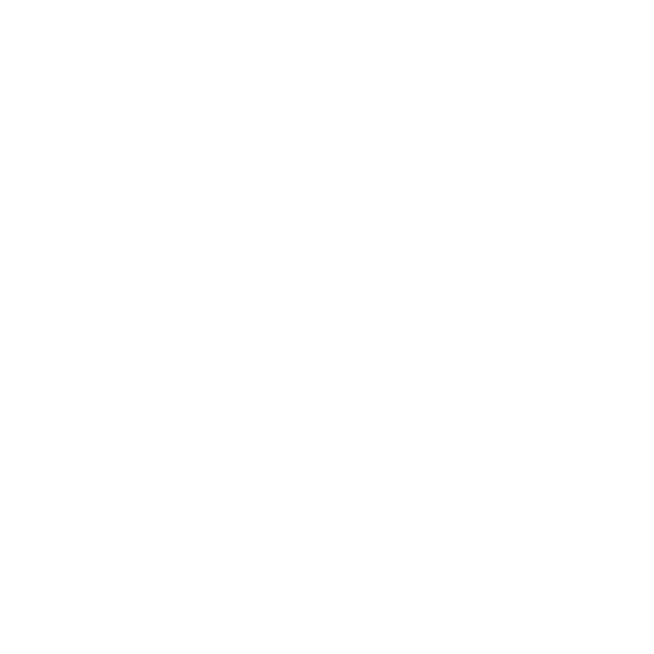

## Customize this file after creating the new REPO and remove this lines.
What to adjust:  
* Add list of used technologies.
* If you have, add a roadmap or remove this section.
* Fill up the section for set up and documentation.
 * Start in this file only with documentation and link to the docs folder.

## ------- end to remove -------

<!-- PROJECT LOGO -->

  

 

<!-- ABOUT THE PROJECT -->
[![Made with love by it@M][made-with-love-shield]][itm-opensource]
[![GitHub license][license-shield]][license]
[![GitHub release version][github-release-shield]][releases]

[made-with-love-shield]: https://img.shields.io/badge/made%20with%20%E2%9D%A4%20by-it%40M-yellow?style=for-the-badge
[license-shield]: https://img.shields.io/github/license/it-at-m/itm-prettier-codeformat?style=for-the-badge
[github-release-shield]: https://img.shields.io/github/v/release/it-at-m/mucgpt?style=for-the-badge

[itm-opensource]: https://opensource.muenchen.de/
[license]: https://github.com/it-at-m/mucgpt/blob/main/LICENSE
[releases]: https://github.com/it-at-m/mucgpt/releases
MUCGPT provides a web interface based on a large language model (LLM). Currently, the interface uses ChatGPT3.5, which allows users to chat, summarise text and brainstorm. The chat function allows text to be generated and refined in several steps. Summarising allows PDFs or text to be shortened and made more concise. Brainstorming allows users to create mind maps for different topics. The included IAC files for Azure make it easy to deploy the project in just a few steps.

### Built With

The documentation project is built with technologies we use in our projects:

* *write here the list of used technologies*

## Roadmap

*if you have a ROADMAP for your project add this here*

See the [open issues](#) for a full list of proposed features (and known issues).

## Set up
*how can i start and fly this project*

## Documentation
*what insights do you have to tell*

use [diagrams](https://docs.github.com/en/get-started/writing-on-github/working-with-advanced-formatting/creating-diagrams).

## Contributing

Contributions are what make the open source community such an amazing place to learn, inspire, and create. Any contributions you make are **greatly appreciated**.

If you have a suggestion that would make this better, please open an issue with the tag "enhancement", fork the repo and create a pull request. You can also simply open an issue with the tag "enhancement".
Don't forget to give the project a star! Thanks again!

1. Open an issue with the tag "enhancement"
2. Fork the Project
3. Create your Feature Branch (`git checkout -b feature/AmazingFeature`)
4. Commit your Changes (`git commit -m 'Add some AmazingFeature'`)
5. Push to the Branch (`git push origin feature/AmazingFeature`)
6. Open a Pull Request

More about this in the [CODE_OF_CONDUCT](/CODE_OF_CONDUCT.md) file.

## License

Distributed under the MIT License. See [LICENSE](LICENSE) file for more information.

## Contact

it@M - opensource@muenchen.de

