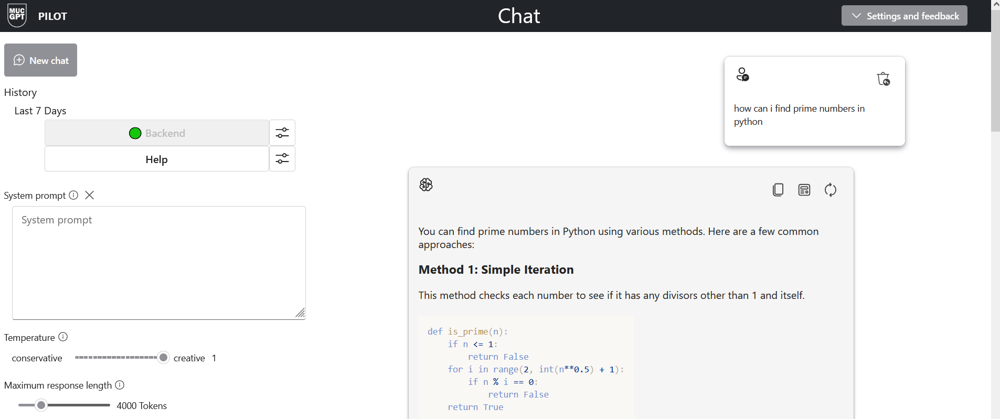

- [Berechtigungen](#berechtigungen)
- [Lokale Entwicklung](#lokale-entwicklung)
  - [Voraussetzungen](#voraussetzungen)
  - [Umgebungskonfiguration](#umgebungskonfiguration)
  - [Deployment](#deployment)
    - [Code hat sich geändert](#code-hat-sich-geändert)
    - [Infrastruktur hat sich geändert](#infrastruktur-hat-sich-geändert)
    - [Code und Infrastruktur haben sich geändert](#code-und-infrastruktur-haben-sich-geändert)
- [Optionale Features](#optionale-features-todo)
  - [Enabling Application Insights](#enabling-application-insights)
- [Lokales laufen Lassen TODO](#lokales-laufen-lassen-todo)
- [Ressourcen](#ressourcen)




# Berechtigungen

## LHM Tennant
- Admin Account
- Zugriff auf die Subscription `sub-stadtmuenchen-workloads-ki-001` im LHM-Tennant
- Rolle `Mitwirkender` auf die drei Unterliegenden Ressourcengruppen
  - `rg-mucgpt-c-euw` Devumgebung
  - `rg-mucgpt-k-euw` Testumgebung, momentan nicht genutzt
  - `rg-mucgpt-p-euw` Produktivumgebung
## Testlhm Tennant (Legacy)
- `testlhm` Admin Account
- Zugriff auf die Subscription `sub-testlhm-earlyaccess-ea-001` im Testlhm-Tennant
- Rolle `Mitwirkender` auf die drei Unterliegenden Ressourcengruppen
  - `rg-openai-demo-c-euw` Pilotumgebung, von den Pilotnutzern genutzt

Siehe auch [Umgebungen konfigurieren](#umgebungskonfiguration)

# Lokale Entwicklung

## Voraussetzungen

Folgende Werkzeuge werden benötigt:

* [Azure Developer CLI](https://aka.ms/azure-dev/install), wird benötigt um das Deployment in azure durchzuführen
* `Python` 3.8+
* `Node.js 14+`, zum Frontend bauen
* `Git`
* `Powershell 7+` (pwsh)

## Umgebungskonfiguration  
Alle Umgebungen sind im [.azure Ordner](.azure/) konfiguriert.
- [Devumgebung LHM-Tennant](.azure/rg-mucgpt-c-euw/): `rg-mucgpt-c-euw`
- [Pilotumgebung LHM-Tennant](.azure/openai-demo-c-euw/): `openai-demo-c-euw`
- [Produktivumgebung LHM-Tennant](.azure/rg-mucgpt-p-euw/): `rg-mucgpt-p-euw`
## Deployment
Es gibt drei verschiedene Fälle.
1. Code Änderung
2. Infrastruktur hat sich geändert
3. Code und Infrastruktur hat sich geändert

### Code hat sich geändert

Wenn sich nur backend/frontend code im [app Ordner](/app/)  sich geändert, müssen die Azure Ressourcen nicht provisioniert werden. Man kann einfach folgenden Befehl aufrufen:

```azd deploy --environment <<env_name>>```

also für die Produktivumgebung:


``azd deploy --environment rg-mucgpt-p-euw````


### Infrastruktur hat sich geändert
Falls sich Infrastruktur geänder hat ([infra Ordner](/infra/)  oder [`azure.yaml`](azure.yaml) oder Konfigurationen im [.azure Ordner](.azure/)), dann müssen Azure Ressourcen reprovisioniert werden. Dies kann mit folgendem Befehl erfolgen:

```azd provision -environment <<env_name>>```

also für die Produktivumgebung:

```azd provision --environment rg-mucgpt-p-euw```

### Code und Infrastruktur haben sich geändert

Falls sich Code & Infrastruktur geändert haben (z.B. beim Neuaufsetzen einer Umgebung), können ```azd provision && azd deploy```mit einem Befehl kombiniert werden:

``` azd up --environment <<env_name>>```

also für die Produktivumgebung:

```azd up --environment rg-mucgpt-p-euw```

## Optionale Features TODO

### Enabling Application Insights

To enable Application Insights and the tracing of each request, along with the logging of errors, set the `AZURE_USE_APPLICATION_INSIGHTS` variable to true before running `azd up`

1. Run `azd env set AZURE_USE_APPLICATION_INSIGHTS true`
1. Run `azd up`

To see the performance data, go to the Application Insights resource in your resource group, click on the "Investigate -> Performance" blade and navigate to any HTTP request to see the timing data.
To inspect the performance of chat requests, use the "Drill into Samples" button to see end-to-end traces of all the API calls made for any chat request:


To see any exceptions and server errors, navigate to the "Investigate -> Failures" blade and use the filtering tools to locate a specific exception. You can see Python stack traces on the right-hand side.

## Lokales Laufen lassen TODO

You can only run locally **after** having successfully run the `azd up` command. If you haven't yet, follow the steps in [Azure deployment](#azure-deployment) above.

1. Run `azd auth login`
2. Change dir to `app`
3. Run `./start.ps1` or `./start.sh` or run the "VS Code Task: Start App" to start the project locally.

## Ressourcen

* [Azure OpenAI Service](https://learn.microsoft.com/azure/cognitive-services/openai/overview)