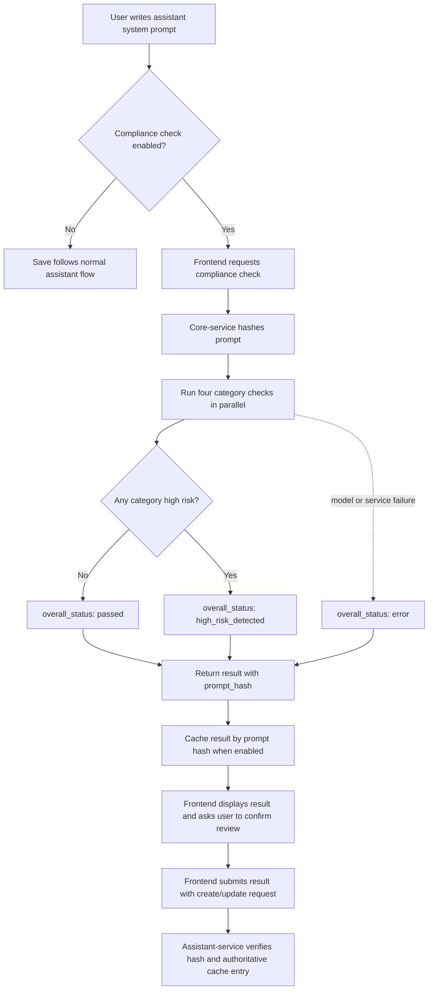
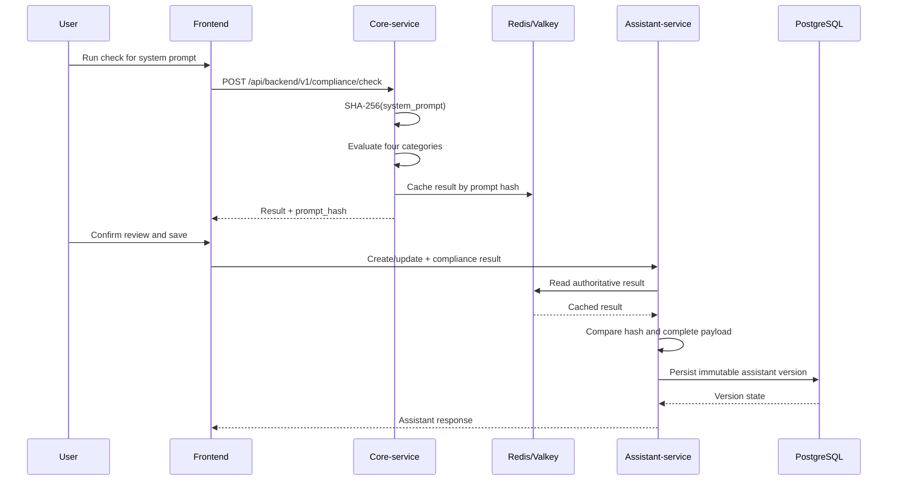
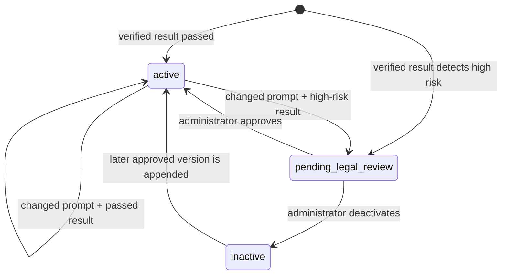

# AI Governance And Assistant Compliance Checks

MUCGPT includes an optional governance workflow for screening assistant system
prompts against selected EU AI Act high-risk use cases. The workflow supports
review and accountability when assistants are created or changed. It does not
make a legal determination, replace qualified legal review, or guarantee that
an assistant is compliant.

## What The Check Covers

The screening evaluates the assistant's **system prompt** independently against
four categories:

| Category ID | Area |
| --- | --- |
| `migration_asylum_border` | Migration, asylum, and border control |
| `public_services_access` | Access to essential public services |
| `hr_employment` | Employment and workforce decisions |
| `education` | Education and vocational training |

Each category returns `passed` or `high_risk_detected`. The overall result is
`high_risk_detected` if any category detects a high-risk use case. A failed model
call produces `error` and cannot be persisted as a verified assistant version.

The result includes a SHA-256 `prompt_hash`. The hash binds the result to the
exact system prompt that was screened; changing whitespace or wording changes
the hash and requires a new check.

## End-To-End Flow

The frontend starts the check while an assistant is being created or edited. The
core-service runs the four category checks in parallel using the configured
internal task model. A successful result is returned to the frontend and, when
enabled, cached in Redis for server-side verification.



The check is advisory until the assistant-service accepts the result as
authoritative for the submitted prompt. A frontend result alone is not trusted.

## Verification Flow

`COMPLIANCE_REQUIRE_VERIFICATION` is enabled by default in the assistant-service.
In strict mode, creating an assistant or updating its system prompt requires a
successful result that matches the current prompt and the authoritative cached
payload.



The assistant-service rejects a result when its prompt hash is wrong, its cache
entry is missing or malformed, or its payload differs from the cached result.
Results with `overall_status: error` cannot be saved. When strict verification is
disabled, the supplied result is accepted without Redis verification; this is
intended only for controlled development or migration scenarios.

## Version Lifecycle

Assistant versions are immutable. The compliance result and lifecycle state are
stored on the version that was screened, not on a mutable assistant-level record.

| Compliance result | Initial version state | Meaning |
| --- | --- | --- |
| No high-risk category detected | `active` | The version can be used according to normal access rules. |
| At least one high-risk category detected | `pending_legal_review` | The version is held for an administrator/legal decision. |
| Check failed | Not persisted | The version cannot be saved as verified. |



An administrator decision appends another immutable version rather than
mutating the reviewed version. The review queue is available through the admin
API at `GET /api/assistant/admin/assistant/review`, and decisions are recorded
with `PATCH /api/assistant/admin/assistant/{assistant_id}/state`.

### Unchanged Prompts

An active version with the same exact prompt hash already represents a verified
decision. Metadata-only updates therefore inherit that persisted compliance
result and do not depend on the short-lived Redis cache. This avoids invalidating
an approved version merely because its name, description, tools, or sharing
metadata changed.

If the system prompt changes, the previous result is not reused. A new check is
required in strict mode, even when the new prompt looks similar to the old one.

## Configuration

### Core-Service

The core-service controls whether the frontend workflow is exposed:

```yaml
AI_ACT_COMPLIANCE_CHECK_ENABLED: true
```

The corresponding environment variable is
`MUCGPT_CORE_AI_ACT_COMPLIANCE_CHECK_ENABLED=true`.

The core-service also controls result caching. The cache is keyed by prompt hash
and is a verification aid, not the system of record:

```yaml
COMPLIANCE_CACHE_ENABLED: true
COMPLIANCE_CACHE_TTL_SECONDS: 1800
```

### Assistant-Service

The assistant-service controls whether submitted results must be verified:

```yaml
COMPLIANCE_REQUIRE_VERIFICATION: true
```

The corresponding environment variable is
`MUCGPT_ASSISTANT_COMPLIANCE_REQUIRE_VERIFICATION=true`.

The persisted version in PostgreSQL is the source of truth for the compliance
result and lifecycle state. Redis entries may expire; unchanged active prompts
remain usable because their persisted result is inherited during metadata-only
updates.

## Operational Responsibilities

- **Assistant authors**: describe the intended use accurately, run the check for
  the current prompt, read the findings, and confirm that the result was reviewed
  before saving.
- **Administrators/legal reviewers**: inspect every version in
  `pending_legal_review`, record a reason, and explicitly approve or deactivate
  it. Approval is a governance decision, not an automatic model conclusion.
- **Service operators**: keep the internal task model, Langfuse prompts, cache,
  and observability configuration available and monitored.
- **Prompt maintainers**: evaluate category-prompt changes against the compliance
  dataset before deploying them.

The category prompts are maintained in the core-service prompt pool and can be
evaluated with the compliance experiment documented in
[`mucgpt-core-service/docs/compliance-experiments.md`](../mucgpt-core-service/docs/compliance-experiments.md).

## Limitations And Failure Handling

- The check evaluates the system prompt, not future inputs, outputs, tools,
  organizational context, or actual use.
- A `passed` result means no configured category was detected by this screening
  workflow. It does not mean that the assistant is legally cleared.
- A `high_risk_detected` result routes the version to review; it does not itself
  prohibit an administrator from approving the version.
- If the model or compliance service fails, the result is `error` and strict mode
  blocks persistence.
- If Redis is unavailable while verifying a newly checked prompt, strict mode
  blocks persistence. This prevents unverified client-provided results from being
  stored.
- The workflow should be supplemented with organizational policy, risk
  assessment, data protection review, human oversight, and any required legal
  controls.

## Related Documentation

- [Getting Started: configuration setup](GETTING_STARTED.md)
- [Compliance experiment and evaluation workflow](../mucgpt-core-service/docs/compliance-experiments.md)
- [User-facing feature overview](FEATURES.md)
